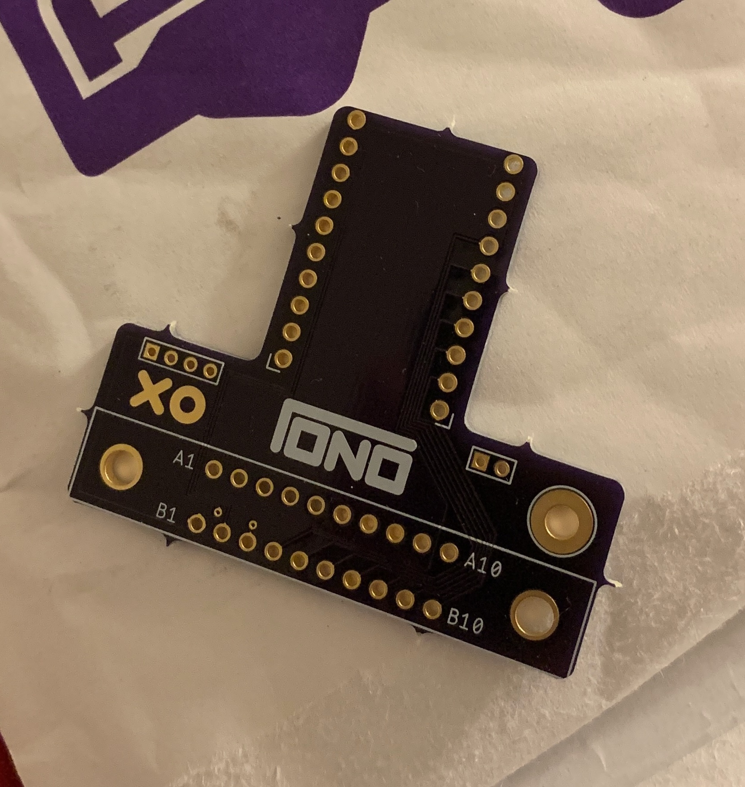
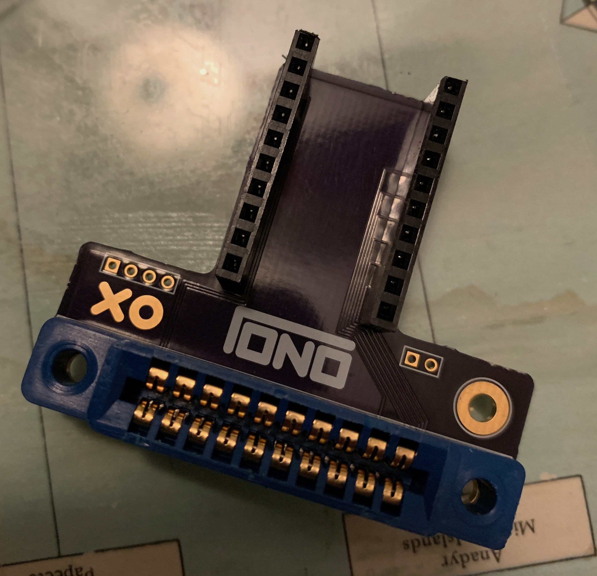
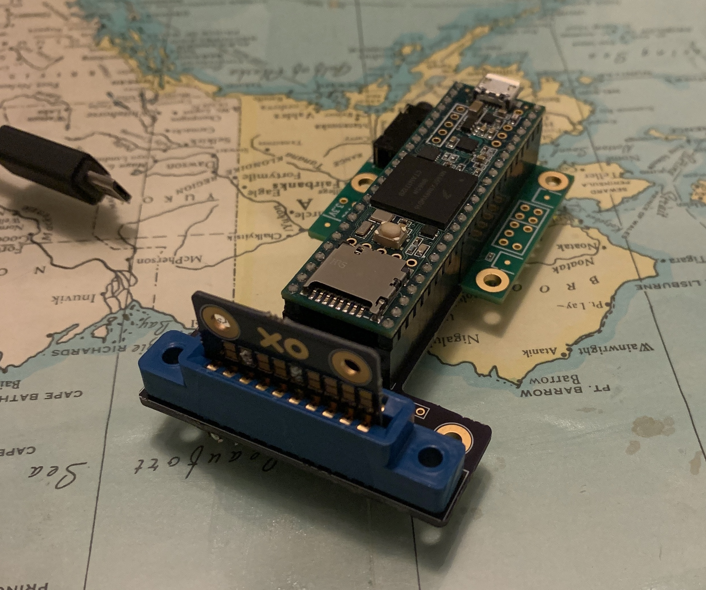

----
title: Tono - Gallery
date: January 3, 2024
desc: Cartridge based digital music player.
skip: true
path: projects/tono/gallery
----

Just blowing the dust off these old pictures and things.

(Really need to fix how images are rendered on my site...)

_Tono 2's First Case Render_

_Tono 2's Second Case Render_

_Tono 2's Final Case Render_

_Tono 2's Final Case Render_

_Messing around with render + different colors.  Here we have 'red', 'green', and 'consturction' (hell yeah dude).

_First round of pcb's_

_The goodies from the final round of pcb's_

_The connector board and assembly_

[Here's a video testing the cart assembly](../../media/img/tono/cart_test.mov)